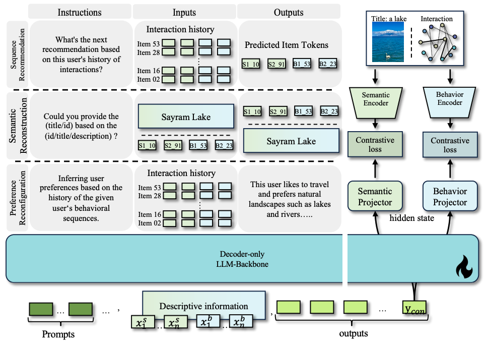

## EAGER-LLM
Code for [EAGER-LLM: Enhancing Large Language Models as Recommenders through Exogenous Behavior-Semantic Integration](https://arxiv.org/pdf/2502.14735)
## Introduction

Large language models (LLMs) are increasingly leveraged as foundational backbones in the development of advanced recommender systems, offering enhanced capabilities through their extensive knowledge and reasoning. Existing llm-based recommender systems (RSs) often face challenges due to the significant differences between the linguistic semantics of pre-trained LLMs and the collaborative semantics essential for RSs. These systems use pre-trained linguistic semantics but learn collaborative semantics from scratch via the llm-Backbone. However, LLMs are not designed for recommendations, leading to inefficient collaborative learning, weak result correlations, and poor integration of traditional RS features. To address these challenges, we propose \textbf{EAGER-LLM}, a decoder-only llm-based generative recommendation framework that integrates endogenous and exogenous behavioral and semantic information in a non-intrusive manner. Specifically, we propose 1) dual-source knowledge-rich item indices that integrates indexing sequences for exogenous signals, enabling efficient link-wide processing; 2) non-invasive multiscale alignment reconstruction tasks guide the model toward a deeper understanding of both collaborative and semantic signals; 3) an annealing adapter designed to finely balance the model’s recommendation performance with its comprehension capabilities. We demonstrate EAGER-LLM’s effectiveness through rigorous testing on three public benchmarks.



## Requirements

```
torch
accelerate
bitsandbytes
deepspeed
evaluate
peft
sentencepiece
tqdm
transformers
```

## Initial training

The detailed scripts are in `run_finetune.sh`:
```shell
DATASET=Instruments # 'Instruments', 'Beauty', 'Sports'
ENCODER_TYPE='concat' # 'din' or 'text'
BASE_MODEL=meta-llama/llama-7b
VERSION=v0
DATA_PATH=./data
OUTPUT_DIR=./checkpoints/$DATASET/$ENCODER_TYPE/$VERSION
SENMANTIC_EMB=./data/${DATASET}/${ENCODER_TYPE}/${VERSION}/${DATASET}.emb-semantic.npy
BEHAVOR_EMB=./data/${DATASET}/${ENCODER_TYPE}/${VERSION}/${DATASET}.emb-behavior.npy

torchrun --nproc_per_node=4 --master_port=23325 src/finetune.py \
    --base_model $BASE_MODEL \
    --output_dir $OUTPUT_DIR \
    --dataset $DATASET \
    --data_path $DATA_PATH \
    --per_device_batch_size 16 \
    --gradient_accumulation_steps 2 \
    --learning_rate 5e-5 \
    --epochs 3 \
    --weight_decay 0.01 \
    --save_and_eval_strategy epoch \
    --deepspeed ./config/ds_z3_bf16.json \
    --bf16 \
    --only_train_response \
    --tasks seqrec,item2index,index2item,fusionseqrec,itemsearch,preferenceobtain \
    --train_prompt_sample_num 1,1,1,1,1,1 \
    --train_data_sample_num 0,0,0,100000,0,0 \
    --index_file .${ENCODER_TYPE}.index.json \
    --encoder_type $ENCODER_TYPE \
    --version $VERSION \
    --semantic_emb $SENMANTIC_EMB \
    --behavior_emb $BEHAVOR_EMB \
```

## Annealing Adapter Tuning

The detailed scripts are in `run_anneal.sh`:
```shell
DATASET=Beauty # 'Instruments', 'Beauty', 'Sports'
ENCODER_TYPE='concat' # 'din' or 'text'
VERSION=v0
CKPT_STEP=3
DATA_PATH=./data
OUTPUT_DIR=./checkpoints/$DATASET/$ENCODER_TYPE/$VERSION
SENMANTIC_EMB=./data/${DATASET}/${ENCODER_TYPE}/${VERSION}/${DATASET}.emb-semantic.npy
BEHAVOR_EMB=./data/${DATASET}/${ENCODER_TYPE}/${VERSION}/${DATASET}.emb-behavior.npy
CKPT_PATH=$OUTPUT_DIR/final-checkpoint-$CKPT_STEP/

if [ ! -e "$CKPT_PATH" ]; then
    cd convert
    ./convert.sh ../$OUTPUT_DIR $CKPT_STEP
    cd ..
else
    echo "Checkpoint exists: $CKPT_PATH"
fi

torchrun --nproc_per_node=4 --master_port=23322 src/anneal_finetune.py \
    --base_model $CKPT_PATH \
    --output_dir $OUTPUT_DIR \
    --dataset $DATASET \
    --data_path $DATA_PATH \
    --per_device_batch_size 16 \
    --gradient_accumulation_steps 2 \
    --learning_rate 5e-5 \
    --epochs 1 \
    --weight_decay 0.01 \
    --save_and_eval_strategy epoch \
    --deepspeed ./config/ds_z3_bf16.json \
    --bf16 \
    --only_train_response \
    --tasks seqrec \
    --train_prompt_sample_num 1 \
    --train_data_sample_num 0 \
    --index_file .${ENCODER_TYPE}.index.json \
    --encoder_type $ENCODER_TYPE \
    --version $VERSION \
    --semantic_emb $SENMANTIC_EMB \
    --behavior_emb $BEHAVOR_EMB \
```

## Inference

The detailed scripts are in `run_test_ddp.sh`:
```shell
DATASET=Instruments # 'Instruments', 'Beauty', 'Sports'
ENCODER_TYPE='concat' # 'din' or 'text'
VERSION=v0
DATA_PATH=./data
CKPT_STEP=3
OUTPUT_DIR=./checkpoints/$DATASET/$ENCODER_TYPE/$VERSION/
CKPT_PATH=$OUTPUT_DIR/final-checkpoint-$CKPT_STEP/
TEST_TASK=seqrec # 
RESULTS_FILE=./results/$DATASET/$ENCODER_TYPE/$VERSION-test-result.json

if [ ! -e "$CKPT_PATH" ]; then
    cd convert
    ./convert.sh ../$OUTPUT_DIR $CKPT_STEP
    cd ..
else
    echo "Checkpoint exists: $CKPT_PATH"
fi

torchrun --nproc_per_node=4 --master_port=23325 src/test_ddp.py \
    --ckpt_path $CKPT_PATH \
    --dataset $DATASET \
    --data_path $DATA_PATH \
    --results_file $RESULTS_FILE \
    --test_batch_size 4 \
    --num_beams 20 \
    --index_file .$ENCODER_TYPE.index.json \
    --version $VERSION \
    --encoder_type $ENCODER_TYPE \
    --metrics "hit@1,hit@5,hit@10,ndcg@5,ndcg@10" \
```


## Reference
The implementation is based on [HuggingFace](https://github.com/huggingface/transformers) and [LC-Rec](https://github.com/zhengbw0324/LC-Rec).
